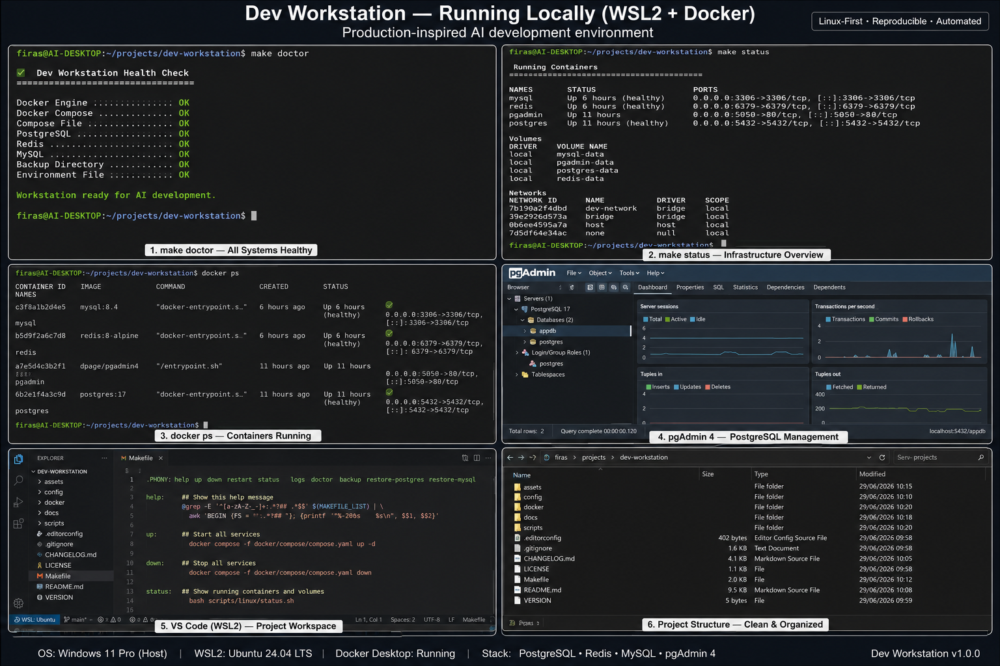

# Dev Workstation

> **A production-inspired AI development workstation that any AI engineer can clone and use in under 30 minutes.**

This repository provides a reproducible, Linux-first development environment for AI engineering using Windows, WSL2, Docker, Conda, Python, Cursor, Visual Studio Code, PostgreSQL, Redis, and MySQL.

The project focuses on reproducibility, automation, and professional engineering practices rather than installation notes.

---

## Architecture

<p align="center">
  
</p>

---

# Live Workstation

The following screenshot shows the workstation running locally on Windows with WSL2, Docker, PostgreSQL, Redis, MySQL, pgAdmin, and the development workspace.

<p align="center">
  
</p>

---


# Features

* Linux-first development using WSL2
* Docker-based local infrastructure
* PostgreSQL development database
* Redis cache
* MySQL development database
* pgAdmin for database administration
* Shared configuration and automation scripts
* Production-inspired repository structure
* Health verification (`make doctor`)
* Infrastructure management (`make up`, `make down`, `make status`)
* Automated database backups
* Architecture Decision Records (ADRs)
* Troubleshooting documentation

---

# Repository Structure

```text
.
├── assets/        Images and diagrams
├── config/        Cursor, VS Code and Git configuration
├── docker/        Docker Compose and container resources
├── docs/          Architecture and documentation
├── scripts/       Automation and maintenance scripts
├── Makefile
├── README.md
└── VERSION
```

---

# Technology Stack

## Operating System

* Windows 10 / 11
* WSL2 (Ubuntu)

## Development

* Cursor
* Visual Studio Code
* Git
* GitHub

## AI Engineering

* Python
* Conda
* Jupyter
* PyTorch
* Transformers
* MLflow
* OpenAI SDK

## Infrastructure

* Docker Desktop
* Docker Compose
* PostgreSQL
* Redis
* MySQL
* pgAdmin

## Mobile Development

* Flutter
* Android Studio

---

# Quick Start

Clone the repository.

```bash
git clone git@github.com:Firas-Armoush-ai/dev-workstation.git

cd dev-workstation
```

Copy the environment template.

```bash
cp docker/compose/.env.example docker/compose/.env
```

Start the workstation.

```bash
make up
```

Verify the environment.

```bash
make doctor
```

Display container status.

```bash
make status
```

The workstation is now ready for AI development.

---

# Daily Commands

| Command        | Description                  |
| -------------- | ---------------------------- |
| `make up`      | Start all services           |
| `make down`    | Stop all services            |
| `make restart` | Restart containers           |
| `make ps`      | Show Docker Compose services |
| `make status`  | Show workstation status      |
| `make doctor`  | Verify workstation health    |
| `make backup`  | Backup PostgreSQL and MySQL  |
| `make logs`    | View container logs          |

---

# Documentation

| Document                   | Purpose                       |
| -------------------------- | ----------------------------- |
| `docs/architecture/`       | System architecture           |
| `docs/decisions/`          | Architecture Decision Records |
| `docs/troubleshooting/`    | Common issues and solutions   |
| `docker/compose/README.md` | Docker operations             |

---

# Repository Principles

* Linux-first development
* Infrastructure as Code
* One source of truth for configuration
* Reproducible environments
* Automation over manual configuration
* Documentation alongside implementation

---

# Roadmap

## Completed

* Windows + WSL2 development
* Docker integration
* PostgreSQL stack
* Redis stack
* MySQL stack
* pgAdmin
* Backup automation
* Health verification
* Shared configuration
* Makefile automation

## Future

* Bootstrap automation
* GitHub Actions
* Dev Containers
* AI project templates

---

# License

This project is licensed under the MIT License.

See the `LICENSE` file for details.
