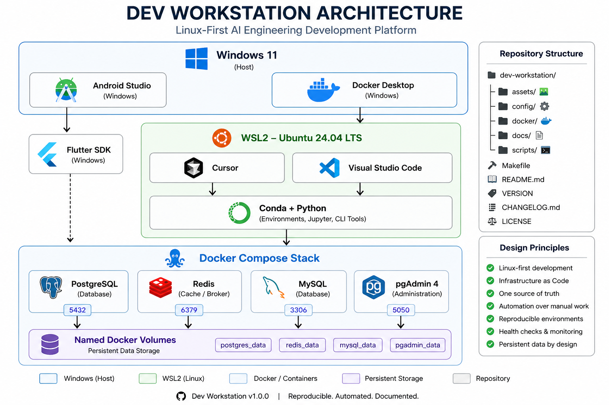

# Development Workstation Architecture

## Overview

The **Dev Workstation** provides a production-inspired, Linux-first AI engineering environment built on Windows, WSL2, Docker, and Conda.

The architecture is designed around four principles:

* Reproducibility
* Automation
* Isolation
* Simplicity

All development is performed inside WSL2 while desktop applications continue to run on Windows.

---

## Architecture Diagram

<p align="center">
  
</p>

---

# High-Level Architecture

```text
                              Windows 11
                                   │
        ┌──────────────────────────┴──────────────────────────┐
        │                                                     │
        │                                             Docker Desktop
        │                                                     │
 Android Studio                                      WSL2 Ubuntu 24.04
        │                                                     │
 Flutter SDK                                   Cursor / VS Code
                                                              │
                                                     Conda + Python
                                                              │
                                                    Docker Compose
                                                              │
         ┌──────────────────────┬──────────────────┬──────────────────────┐
         │                      │                  │                      │
    PostgreSQL              Redis             MySQL                 pgAdmin
         │                      │                  │
         └────────────── Named Docker Volumes ──────────────┘
```

---

# Repository Architecture

```text
dev-workstation/
│
├── assets/
├── config/
├── docker/
├── docs/
├── scripts/
│
├── Makefile
├── README.md
├── VERSION
├── CHANGELOG.md
└── LICENSE
```

---

# Configuration Strategy

The workstation follows a **single source of truth** approach.

| Component             | Configuration                 |
| --------------------- | ----------------------------- |
| Docker Compose        | `docker/compose/compose.yaml` |
| Environment Variables | `docker/compose/.env`         |
| Cursor                | `config/cursor/`              |
| VS Code               | `config/vscode/`              |
| Git                   | `config/git/`                 |

No credentials, paths, or environment variables are duplicated across scripts.

---

# Automation Architecture

Automation is organized by responsibility.

```text
scripts/
├── backup/
│   ├── backup-all.sh
│   ├── backup-postgres.sh
│   ├── backup-mysql.sh
│   ├── restore-postgres.sh
│   └── restore-mysql.sh
│
├── lib/
│   └── common.sh
│
├── linux/
│   ├── doctor.sh
│   └── status.sh
│
└── windows/
```

The `common.sh` library provides a shared configuration layer used by all Linux automation scripts.

---

# Infrastructure Services

| Service    | Purpose                   |
| ---------- | ------------------------- |
| PostgreSQL | Relational database       |
| Redis      | Cache and message broker  |
| MySQL      | Relational database       |
| pgAdmin    | PostgreSQL administration |

Each service:

* runs inside Docker
* has health checks
* uses persistent named volumes
* is managed through Docker Compose

---

# Engineering Principles

The workstation follows these principles:

* Linux-first development
* Infrastructure as Code
* One source of truth
* Automation over manual configuration
* Reproducible environments
* Health verification before development
* Conventional Commits
* Semantic Versioning
* Architecture Decision Records (ADRs)

---

# Development Workflow

Every infrastructure change follows the same lifecycle.

1. Design
2. Implement
3. Verify
4. Document
5. Commit
6. Push
7. Release

Verification is mandatory before documentation or release.

---

# Architecture Status

| Component            | Status |
| -------------------- | :----: |
| Repository Structure |    ✅   |
| Docker Compose       |    ✅   |
| PostgreSQL           |    ✅   |
| Redis                |    ✅   |
| MySQL                |    ✅   |
| pgAdmin              |    ✅   |
| Backup Automation    |    ✅   |
| Shared Configuration |    ✅   |
| Health Verification  |    ✅   |
| Documentation        |    ✅   |
